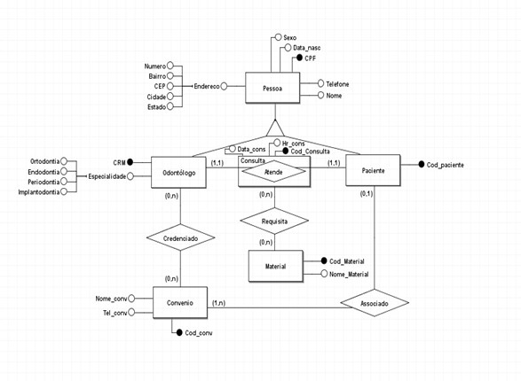
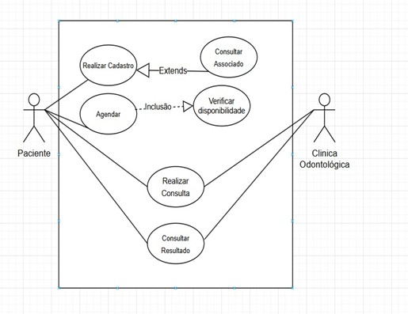
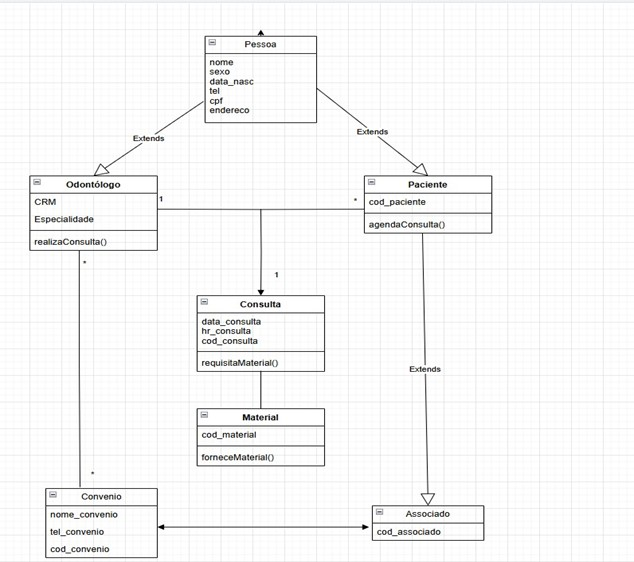

# Clínica Odontológica

O projeto consiste em esquemas para uma clínica odontológica fictícia, com o intuito de melhoras as habilidades na modelagem de um banco de dados compondo um esquema conceitual, lógico e físico.

## Esquema conceitual: 

## [Esquema Lógico](ESQUEMAS/EsquemaLogico.txt)

## [Esquema Físico](ESQUEMAS/EsquemaFisico.sql)

## Diagramas de Caso de Uso:

## Diagramas de Classe:

